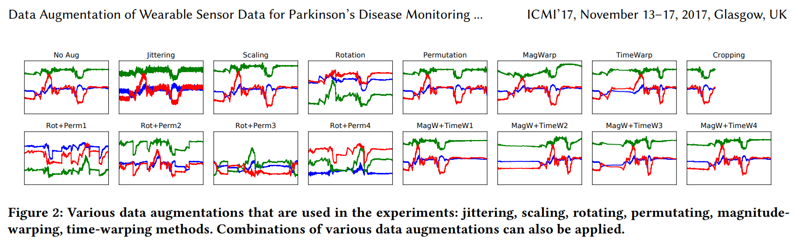

<<<<<<< HEAD
# **Sensor Data Filtering and Augmentation Tools**

## **Motivation**

This set of libraries contains various methods to help with sensor data
filtering, data augmentation, and data preparation for use in Keras and 
TensorFlow models along with computing and then plotting t-SNE, PCA, and ICA calculations.
Some functions from this library rely on a [data augmentation 
library](https://github.com/maddyarmstrong/Data-Augmentation-For-Wearable-Sensor-Data/blob/master/DataAugmentation.py)
found in another repository.  The filtering technique in this library hinges on a
multi-resoultion windowing approach coupled with variance filtering. This
technique was orginially developed to determine the start and end time of an
activity in a given window where the activity is characterized by increased variance in the sensor data. The library has the capabilty to create different window types for data preprocessing, create training, validation, and testing sets from given percentages, and create tf.data.Dataset from inputted data. 

## Tutorial

A tutorial for how to use the libraries and their capabilites can be found **here**. The tutorial explores the how to use these libraries on an academic dataset of simulated smart watch data from [this study](https://archive.ics.uci.edu/ml/datasets/Dataset+for+ADL+Recognition+with+Wrist-worn+Accelerometer).

## Dependencies

 Most of these dependencies can be installed using ```pip``` except ```DataAugmentation.py``` which can be found [here](https://github.com/maddyarmstrong/Data-Augmentation-For-Wearable-Sensor-Data/blob/master/DataAugmentation.py). 

To use ```pip``` in Google Colab: ```!pip (command)```

*  Python (3.8.5)
* [DataAugmentation.py](https://github.com/maddyarmstrong/Data-Augmentation-For-Wearable-Sensor-Data/blob/master/DataAugmentation.py)
* numpy (1.18.5)
* matplotlib (3.2.2)
* TensorFlow (2.3.0)
* seaborn (0.10.1)
* [transforms3d](https://matthew-brett.github.io/transforms3d/index.html)   (to install in Google Colab: ```!pip install transforms3d```)
* scikit-learn (0.23.1)
    * TSNE
    * PCA
    * FastICA
* skimage (0.17.2)
* dataclasses
=======
# Data-Augmentation-For-Wearable-Sensor-Data

This is a sample code of data augmentation methods for wearable sensor data (time-series data). The example code writen in Jupyter notebook can be found [here](https://github.com/terryum/Data-Augmentation-For-Wearable-Sensor-Data/blob/master/Example_DataAugmentation_TimeseriesData.ipynb) or [here](https://nbviewer.jupyter.org/github/terryum/Data-Augmentation-For-Wearable-Sensor-Data/blob/master/Example_DataAugmentation_TimeseriesData.ipynb). For more details, please refer to the the paper below.

T. T. Um et al., “Data augmentation of wearable sensor data for parkinson’s disease monitoring using convolutional neural networks,” in Proceedings of the 19th ACM International Conference on Multimodal Interaction, ser. ICMI 2017. New York, NY, USA: ACM, 2017, pp. 216–220. [[arXiv]](https://arxiv.org/abs/1706.00527)

## Motivation

Data augmentation is consider as a standard preprocessing in various recognition problems (e.g. image recognition), which gives additional performance improvement by providing more data. Data augmentation can be also interpreted as injecting human's prior knowledge about label-preserving transformation and giving regularization by data. This code provides a simple approach to augment time-series data, e.g., wearable sensor data, by applying various distortions to the data. 

## Data augmentation examples
Please see the jupyter notebook file ([here](https://github.com/terryum/Data-Augmentation-For-Wearable-Sensor-Data/blob/master/Example_DataAugmentation_TimeseriesData.ipynb) or [here](https://nbviewer.jupyter.org/github/terryum/Data-Augmentation-For-Wearable-Sensor-Data/blob/master/Example_DataAugmentation_TimeseriesData.ipynb)) for more examples



## Dependency
You need to pre-install numpy, matplotlib, scipy, and transforms3d for running the code. (You can install them using `pip`)

## License
You can freely modify this code for your own purpose. However, please leave the citation information untouched when you redistributed the code to others. If this code helps your research, please cite the paper.

```
@inproceedings{TerryUm_ICMI2017,
 author = {Um, Terry T. and Pfister, Franz M. J. and Pichler, Daniel and Endo, Satoshi and Lang, Muriel and Hirche, Sandra and Fietzek, Urban and Kuli\'{c}, Dana},
 title = {Data Augmentation of Wearable Sensor Data for Parkinson's Disease Monitoring Using Convolutional Neural Networks},
 booktitle = {Proceedings of the 19th ACM International Conference on Multimodal Interaction},
 series = {ICMI 2017},
 year = {2017},
 isbn = {978-1-4503-5543-8},
 location = {Glasgow, UK},
 pages = {216--220},
 numpages = {5},
 doi = {10.1145/3136755.3136817},
 acmid = {3136817},
 publisher = {ACM},
 address = {New York, NY, USA},
 keywords = {Parkinson\&\#39;s disease, convolutional neural networks, data augmentation, health monitoring, motor state detection, wearable sensor},
} 
```
>>>>>>> master-holder
